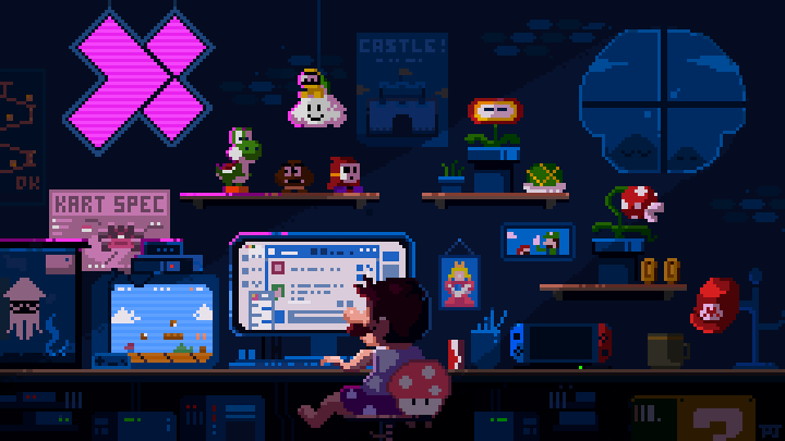

I'm Brandon `Software Engineer student`, specializing in `Backend` and `AI/ML`.

  

         

    <a href="https://ossinsight.io/analyze/BranGitfox">
        <picture>
        <source media="(prefers-color-scheme: dark)" srcset="https://github-readme-activity-graph.vercel.app/graph?username=branGitfox&theme=react-dark&hide_border=true&hide_title=false&area=true&custom_title=Total%20contribution%20graph%20in%20all%20repo" >
                            
        </picture>
    </a>

