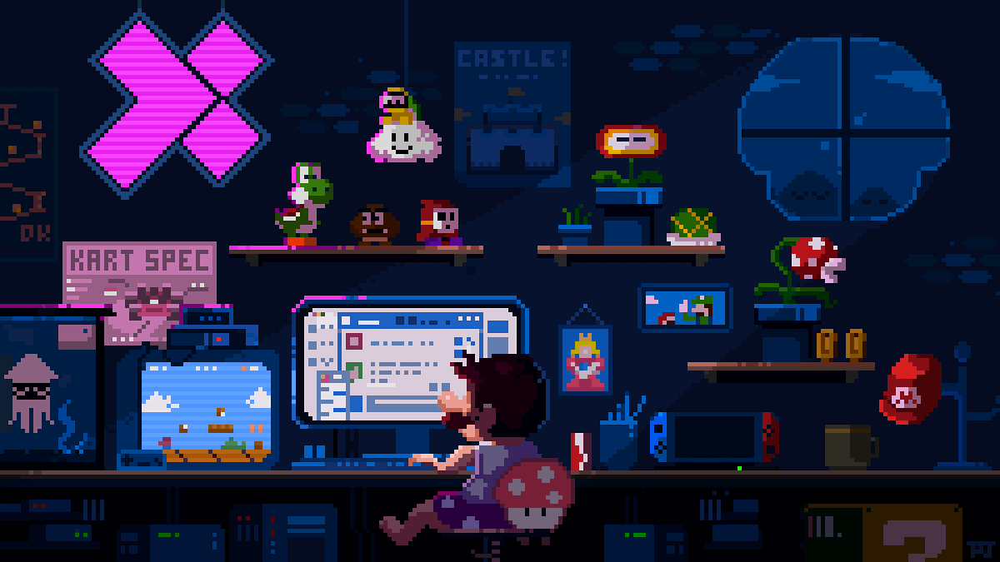

I'm Brandon `Software Engineer student`, specializing in `Backend` and `AI/ML`.

  

  <!-- AI / Data Science -->
  
  
  
  
  
  
  
  
  
  
  
  
  
  
  
  
  
  
  
  
  
  
  
  
  
  
  
  
  
  
  
  
  
  
  
  
  
  
  
  
  
  
  
  
  

